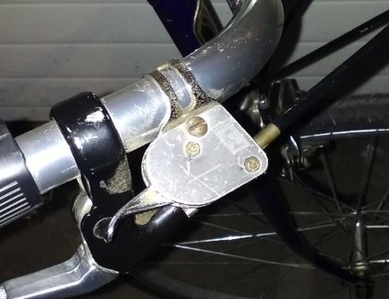
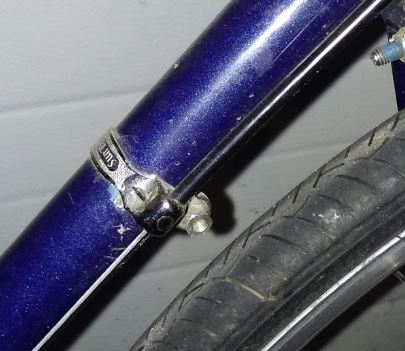
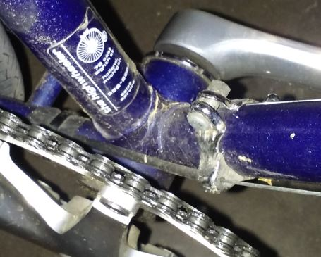

# OldSturmeyArcher
Cabling a Sturmey Archer AW hub on an old road frame

This is about how I routed the cable for a 1960s Sturmey Archer AW hub on a 1980s steel road frame with no cable braze-ons. I'm not a professional bike mechanic. You need to be qualified to work on your bike in order to proceed with this, because you must ensure that your bike is safe to ride.

The trigger shifter fits on a standard pair of swept handlebars. That's the first and last time we'll see any Sturmey Archer parts until we get to the bottom:

I took a couple of old fashioned SunTour cable guides, typically found on low end bikes, and cut off the portion that's for routing the front derailleur cable. One of them bolts on where the downtube shifters used to be:

Likewise at the bottom:

A piece of cable housing guides the cable down the chainstay, and is secured in two places with innertube rubber and plastic cable ties. Here:

<image src="chainstay1.jpg">

and here:

<image src="chainstay2.jpg">
